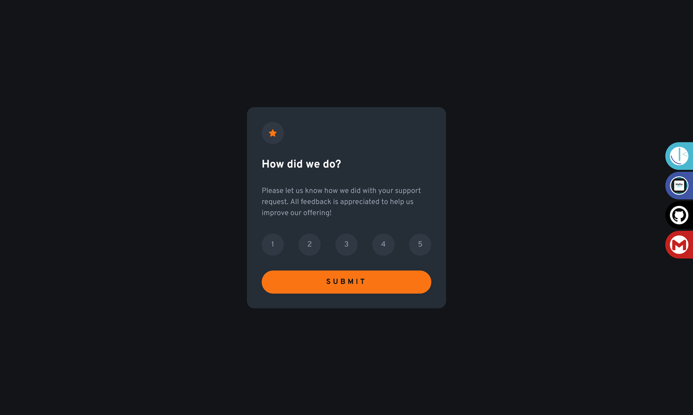
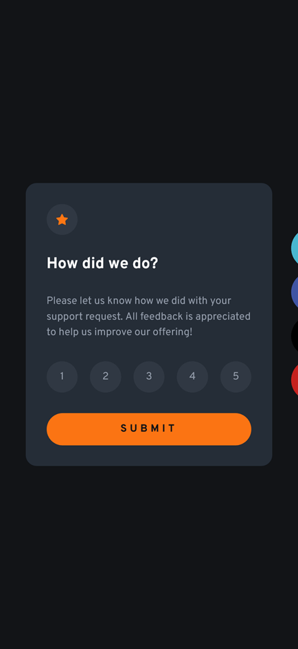

# Frontend Mentor - Four card feature section solution

This is a solution to the [Four card feature section challenge on Frontend Mentor](https://www.frontendmentor.io/challenges/four-card-feature-section-weK1eFYK). Frontend Mentor challenges help you improve your coding skills by building realistic projects. 

## Table of contents

- [Overview](#overview)
  - [The challenge](#the-challenge)
  - [Screenshot](#screenshot)
  - [Links](#links)
- [My process](#my-process)
  - [Built with](#built-with)
  - [Useful resources](#useful-resources)
- [Author](#author)
- [Acknowledgments](#acknowledgments)

**Note: Delete this note and update the table of contents based on what sections you keep.**

## Overview

### The challenge

Users should be able to:

- View the optimal layout for the site depending on their device's screen size.
- See hover states for all interactive elements on the page
- Select and submit a number rating
- See the "Thank you" card state after submitting a rating. The cards show up with animations.

### Screenshot

#### Desktop

##### The rating card

##### The "Thank you" card

#### Mobile

##### The rating card

##### The "Thank you" card

### Links

- Solution URL: [Github repository solution URL here](https://github.com/hadodev/InteractiveRatingComponentMain)
- Live Site URL: [Live site URL here](https://hadodev-frontendmentor-interactrating.netlify.app)

## My process

### Built with

- Semantic HTML5 markup
- CSS custom properties
- Flexbox
- CSS Grid
- Mobile-first workflow

### Useful resources

- [CSS reset](https://piccalil.li/blog/a-more-modern-css-reset/) - Modern CSS reset.
- [Image compressor](https://imagecompressor.com/) - This online image optimizer uses a smart combination of the best optimization and lossy compression algorithms to shrink JPEG, GIF and PNG images to the minimum possible size while keeping the required level of quality.
- [@font-face generator](https://transfonter.org/) - Modern and simple css @font-face generator.
- [Google Fonts](https://fonts.google.com/)
- [1 line layouts](https://1linelayouts.glitch.me/) - 10 Modern CSS layout and sizing techniques that highlight just how robust and impactful a single-line of styling code can be.

## Author

- GitHub - [Hado Dev](https://github.com/hadodev)
- Frontend Mentor - [@hadodev](https://www.frontendmentor.io/profile/hadodev)

## Acknowledgments

For all authors who publish open source ressources and contents freely available and make Internet more awesome.
